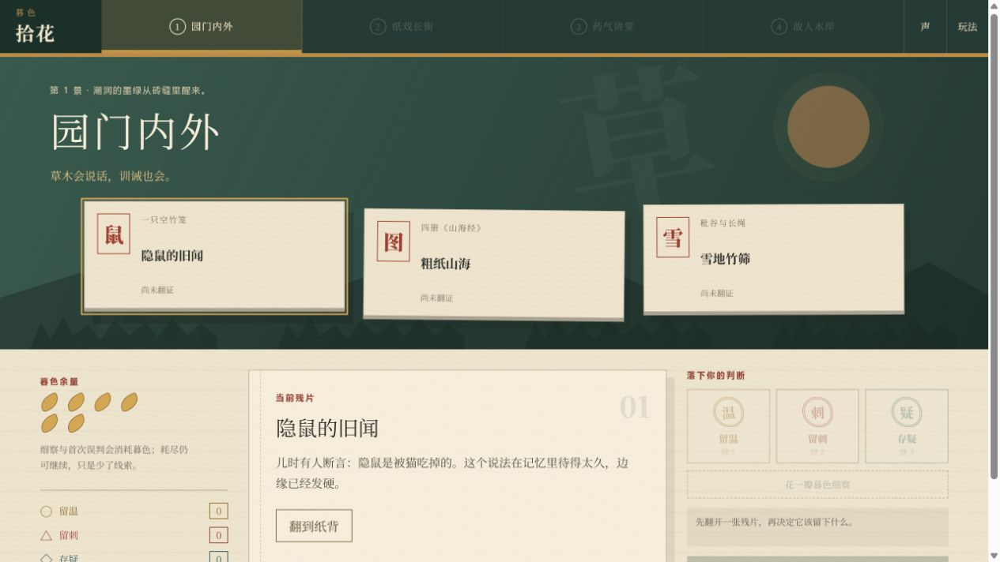
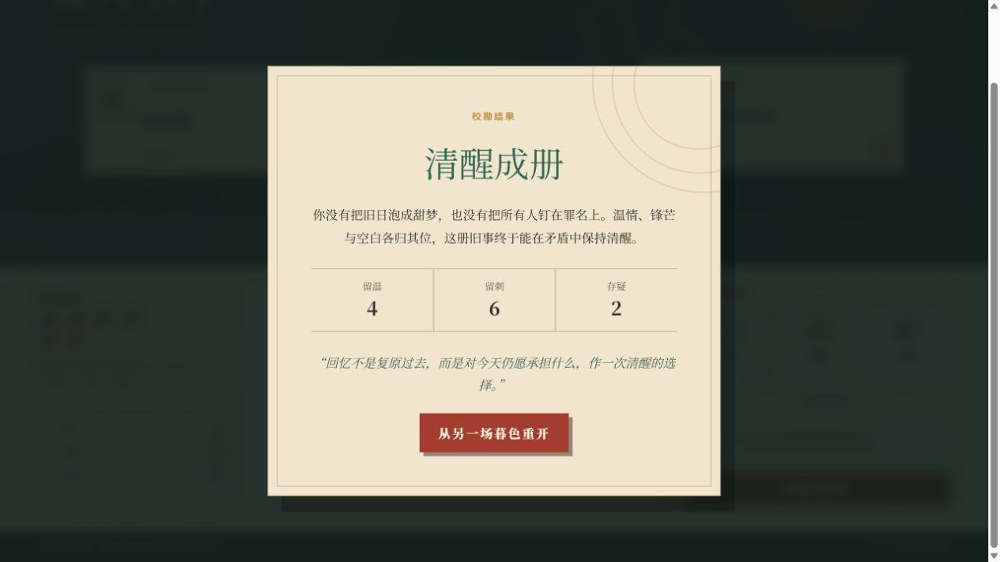

# 暮色拾花

一款约 15 分钟可完整通关的《朝花夕拾》原创视角网页游戏。

玩家不是鲁迅，也不扮演原作中的任何人物，而是以原创“拾花校勘员”身份进入四处纸景，通过翻证、细察和落印，重新判断旧事应当保留温情、留下锋芒，还是承认疑问。

[在线试玩](https://muse-flower-zhaohuaxishi.niteappshelps.chatgpt.site)



## 游戏特色

- 四个连续纸景、12 张跨篇章记忆残片，完整一局约 15 分钟。
- “留温、留刺、存疑”三类印记会改变纸景状态和最终结果。
- 6 瓣暮色既可用于细察，也会因首次误判而消耗；耗尽后仍能通关。
- “隐鼠—阿长”包含跨页证据回流，会强制玩家重新判断旧结论。
- 支持偏色结局、返回修订、清醒结局和完全重开。
- 支持桌面、手机、鼠标、触屏与键盘操作。
- 不逐段复演原作，而是把不同篇章中的人情、批判与不确定性重新组织为可玩的判断系统。

## 操作方式

1. 选择一张记忆残片并翻到纸背。
2. 可花一瓣暮色“细察”，获得额外线索。
3. 盖下“留温、留刺、存疑”之一。
4. 根据纸景抵牾、回流证据和最终装帧结果修订判断。

键盘玩家可使用 Tab/Enter 操作；翻证后按 `1`、`2`、`3` 快速落印。

## 本地运行

需要 Node.js 22.13+ 和 pnpm 11+。

```bash
pnpm install
pnpm dev
```

开发服务器启动后，打开终端显示的本地地址。

Windows 用户也可以双击项目根目录中的 `启动暮色拾花.ps1`。

## 检查与构建

```bash
pnpm lint
pnpm test
pnpm build
```

`pnpm test` 会先完成生产构建，再执行服务端渲染和游戏结构测试。

## 项目结构

```text
app/                   游戏页面、布局与全局样式
public/                分享封面与游戏截图
docs/                  原作分析、概念、游戏设计、美术方向与 QA 报告
tests/                 自动化结构和服务端渲染测试
worker/                Cloudflare Worker 入口
.github/               CI、Issue 与 Pull Request 模板
```

## 设计与 QA

- [原作游戏化分析](docs/SOURCE_BIBLE.md)
- [概念方案与选择](docs/CONCEPT.md)
- [游戏设计](docs/GAME_DESIGN.md)
- [美术方向](docs/ART_DIRECTION.md)
- [构建说明](docs/BUILD_BRIEF.md)
- [QA 报告](docs/QA_REPORT.md)



## 技术栈

- React 19
- Next.js 16 兼容 API
- vinext / Vite
- TypeScript
- Tailwind CSS 4
- Cloudflare Workers 兼容构建

## 改编说明

本项目为原创互动改编，不代表鲁迅、原出版机构或其他权利主体。原作文本的使用与传播应遵守所在地区适用的版权法律。游戏代码、美术和文档目前未附开放源代码许可证；除非项目所有者另行添加许可证，否则不视为授予复制、修改或再发布权利。

## 参与项目

欢迎通过 Issue 报告问题或提出建议。提交代码前请阅读 [CONTRIBUTING.md](CONTRIBUTING.md)。
